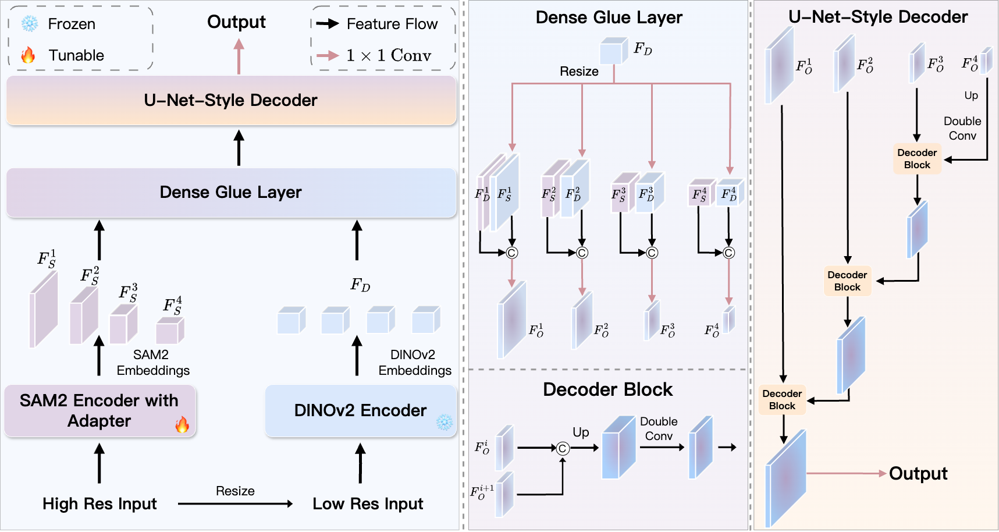

## [SAM2-UNeXT: An Improved High-Resolution Baseline for Adapting Foundation Models to Downstream Segmentation Tasks]()
Xinyu Xiong, Zihuang Wu, Lei Zhang, Lei Lu, Ming Li, Guanbin Li

## Introduction
Recent studies have highlighted the potential of adapting the Segment Anything Model (SAM) for various downstream tasks. However, constructing a more powerful and generalizable encoder to further enhance performance remains an open challenge. In this work, we propose SAM2-UNeXT, an advanced framework that builds upon the core principles of SAM2-UNet while extending the representational capacity of SAM2 through the integration of an auxiliary DINOv2 encoder. By incorporating a dual-resolution strategy and a dense glue layer, our approach enables more accurate segmentation with a simple architecture, relaxing the need for complex decoder designs. Extensive experiments conducted on four benchmarks, including dichotomous image segmentation, camouflaged object detection, marine animal segmentation, and remote sensing saliency detection, demonstrate the superior performance of our proposed method.

[微信交流群](https://github.com/WZH0120/SAM2-UNet/blob/main/wechat.jpg)

## Clone Repository
SAM2-UNeXT is an improved version based on SAM2-UNet, so it is recommended that new users first become familiar with the [previous version](https://github.com/WZH0120/SAM2-UNet/).
```shell
git clone https://github.com/WZH0120/SAM2-UNeXT.git
cd SAM2-UNeXT/
```

## Prepare Datasets
You can refer to the following repositories and their papers for the detailed configurations of the corresponding datasets.
- Dichotomous Image Segmentation. Please refer to [BiRefNet](https://github.com/ZhengPeng7/BiRefNet).
- Camouflaged Object Detection. Please refer to [FEDER](https://github.com/ChunmingHe/FEDER). [#issue [#13](https://github.com/WZH0120/SAM2-UNet/issues/13), [#44](https://github.com/WZH0120/SAM2-UNet/issues/44)]
- Marine Animal Segmentation. Please refer to [MASNet](https://github.com/zhenqifu/MASNet).
- Remote Sensing Saliency Detection. Please refer to [ORSI-SOD](https://github.com/MathLee/ORSI-SOD_Summary?tab=readme-ov-file#orsi-sod-datasets-download----).

## Requirements
Our project does not depend on installing SAM2. If you have already configured an environment for SAM2, then directly using this environment should also be fine. You may also create a new conda environment:

```shell
conda create -n sam2-unext python=3.10
conda activate sam2-unext
pip install -r requirements.txt
```

## Training
If you want to train your own model, please download:
* the pre-trained segment anything 2 (not SAM2.1, [#issue [#18](https://github.com/WZH0120/SAM2-UNet/issues/18), [#30](https://github.com/WZH0120/SAM2-UNet/issues/30)]) from [here](https://dl.fbaipublicfiles.com/segment_anything_2/072824/sam2_hiera_large.pt)
* the pre-trained dinov2 from [here](https://huggingface.co/timm/vit_large_patch14_dinov2.lvd142m/resolve/main/model.safetensors?download=true)

After the above preparations, you can run `train.sh` to start your training.

## Testing
Our prediction maps can be found at [Google Drive](https://drive.google.com/drive/folders/1VNlUptVWw16Ro4VocCFRqBZurmXxaSWY?usp=sharing). Also, you can run `test.sh` to obtain your own predictions.

## Evaluation
After obtaining the prediction maps, you can run `eval.sh` to get the quantitative results.

## Citation and Star
Please cite the following paper and star this project if you use this repository in your research. Thank you!
```
TBD
```

## Acknowledgement
[segment anything 2](https://github.com/facebookresearch/segment-anything-2)&emsp;[SAM2-UNet](https://github.com/WZH0120/SAM2-UNet/)&emsp;[DSU-Net](https://github.com/CheneyXuYiMin/SAM2DINO-Seg)
